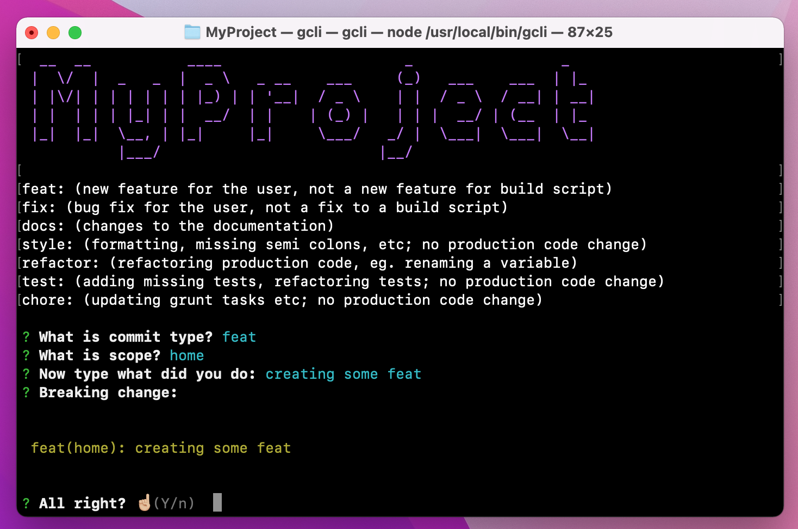

# gcli

[](https://github.com/daflecardoso/gcli/actions/workflows/ci.yml)
[](https://github.com/daflecardoso/gcli/releases/latest)
[](https://goreportcard.com/report/github.com/daflecardoso/gcli)
[](go.mod)
[](LICENSE)

An interactive CLI that walks you through writing a [Conventional
Commits](https://www.conventionalcommits.org/en/v1.0.0/)-compliant commit
message, then runs `git add`, `git commit`, and `git push` for you.

Ships as a single native binary — no Node.js, no Go toolchain, and no other
runtime required to install or run it.



## Table of contents

- [Features](#features)
- [Installation](#installation)
- [Configuration](#configuration)
- [Usage](#usage)
- [Updating](#updating)
- [Development](#development)
- [Architecture](#architecture)
- [Releasing](#releasing)
- [Contributing](#contributing)
- [License](#license)

## Features

- Guided prompts for commit `type`, `scope`, message, and optional breaking
  change, producing a Conventional Commits message
- Per-project configuration (`gcli.json`) — name, banner color, custom scopes
- Runs `git add . && git commit && git push` once you confirm the message
- Self-update (`gcli --update`) that always fetches the latest release
- Single static binary for Linux, macOS, and Windows (amd64 + arm64) — nothing
  to install beyond the binary itself

## Installation

**Linux / macOS**

```sh
curl -fsSL https://raw.githubusercontent.com/daflecardoso/gcli/main/install.sh | sh
```

**Windows (PowerShell)**

```powershell
iwr -useb https://raw.githubusercontent.com/daflecardoso/gcli/main/install.ps1 | iex
```

Both scripts detect your OS/architecture, download the matching binary from
the [latest release](https://github.com/daflecardoso/gcli/releases/latest),
and put it on your `PATH`. No compiler, package manager, or language runtime
is required on the target machine.

## Configuration

Create a `gcli.json` file in the root of the project you want to commit in:

```json
{
  "name": "my-project",
  "color": "#1476FF",
  "showTutorial": false,
  "scopes": ["home", "products", "foo", "bar"]
}
```

| Field          | Type       | Description                                             |
| -------------- | ---------- | --------------------------------------------------------- |
| `name`         | `string`   | Displayed in the banner when `gcli` starts                |
| `color`        | `string`   | Banner color, as a `#RRGGBB` hex value                     |
| `showTutorial` | `bool`     | Prints a Conventional Commits type cheat-sheet on start   |
| `scopes`       | `[]string` | Scopes offered in the interactive scope prompt             |

## Usage

Run `gcli` inside a git repository that has a `gcli.json`:

```sh
gcli
```

You'll be prompted for:

1. Commit **type** (`feat`, `fix`, `docs`, `style`, `refactor`, `test`, `chore`)
2. **Scope** (one of the `scopes` from `gcli.json`)
3. Commit **message**
4. Optional **breaking change** description

`gcli` then shows the assembled message and, once you confirm, runs:

```sh
git add .
git commit -m "<type>(<scope>): <message>"
git push
```

## Updating

```sh
gcli --update
```

This re-runs the install script, which always pulls the binary tagged
`latest` on GitHub Releases.

## Development

Requires Go 1.21+.

```sh
git clone https://github.com/daflecardoso/gcli.git
cd gcli

make build   # go build -o gcli ./cmd/gcli
make test    # go test ./... -race -covermode=atomic -coverprofile=coverage.out
make lint    # golangci-lint run ./...
```

## Architecture

```
cmd/gcli/            entry point: flag handling and prompt orchestration
internal/config/      gcli.json loading
internal/commit/      Conventional Commits message building (pure, unit tested)
internal/ui/           banner, colored output, interactive prompts
internal/gitutil/      thin wrapper around the git CLI (add/commit/push/pull)
internal/update/       self-update via the install script
internal/version/      build metadata injected by GoReleaser (-ldflags)
```

Business logic that doesn't need a terminal or the filesystem (message
formatting, hex-color parsing, update command construction) is kept in small
pure functions so it can be unit tested without mocking I/O.

## Releasing

Releases are built by [GoReleaser](https://goreleaser.com) via
[`.github/workflows/release.yml`](.github/workflows/release.yml), triggered
by pushing a version tag:

```sh
git tag v1.2.3
git push origin v1.2.3
```

This builds binaries for linux/darwin/windows (amd64/arm64), publishes them
as a GitHub Release, and bakes the version/commit/date into the binary
(`gcli --version`). `install.sh` / `install.ps1` always install whatever is
tagged `latest`.

## Contributing

Pull requests are welcome. Please make sure `make test` and `make lint` pass
before opening one, and keep commit messages in the same Conventional
Commits format `gcli` itself produces (fittingly, `gcli` was used to write
this project's own commits).

## License

[ISC](LICENSE)
